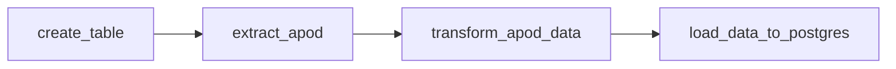

#  Airflow ETL Pipeline: NASA APOD to Postgres

An ETL (Extract, Transform, Load) pipeline built with **Apache Airflow 3**. It pulls data from NASA's Astronomy Picture of the Day (APOD) API, keeps the useful fields, and stores them in a **PostgreSQL** database. Everything runs in Docker through the Astro CLI.


##  Table of Contents

- [Overview](#-overview)
- [Tech Stack](#-tech-stack)
- [Pipeline Architecture](#-pipeline-architecture)
- [Getting Started](#-getting-started)
- [Airflow Connections](#-airflow-connections)
- [Database Schema](#-database-schema)
- [Verifying the Data](#-verifying-the-data)

##  Overview

The pipeline does three things on a schedule:

1. **Extract** the picture of the day and its metadata from NASA's APOD API.
2. **Transform** the JSON response, keeping only the fields worth storing.
3. **Load** the result into a Postgres table, ready for analysis, reporting, or visualization.

Airflow orchestrates the whole workflow: it schedules the runs, manages the dependencies between tasks, and lets you monitor each execution from its UI.


##  Tech Stack

| Component | Role |
|---|---|
| **Apache Airflow 3** | Defines, schedules, and monitors the pipeline (DAG `ETL_pipeline`) |
| **Astro CLI + Docker** | Runs Airflow and Postgres in an isolated, reproducible environment |
| **PostgreSQL** | Stores the extracted and transformed data |
| **NASA APOD API** | Data source: title, explanation, and URL of the daily astronomy picture |

Airflow building blocks used in the DAG:

- `HttpOperator` to call the NASA API
- `PostgresHook` to create the table and insert rows
- TaskFlow API (`@task`) for the Python tasks

##  Pipeline Architecture



| Step | Task | What it does |
|---|---|---|
| Setup | `create_table` | Creates the `apod_data` table if it does not exist yet |
| **E**xtract | `extract_apod` | Sends a GET request to `planetary/apod` and returns the JSON response |
| **T**ransform | `transform_apod_data` | Keeps `title`, `explanation`, `url`, `date`, and `media_type` |
| **L**oad | `load_data_to_postgres` | Inserts the transformed record into Postgres |

The DAG is scheduled with `@monthly`. Change the `schedule` argument in `dags/etl.py` (for example to `@daily`) to collect a picture every day.

##  Getting Started

### Prerequisites

- [Docker Desktop](https://www.docker.com/products/docker-desktop/)
- [Astro CLI](https://www.astronomer.io/docs/astro/cli/install-cli)
- A free NASA API key from [api.nasa.gov](https://api.nasa.gov/)

### Installation

1. Clone the repository and move into it:

   ```bash
   git clone <your-repo-url>
   cd <your-repo-folder>
   ```

2. Make sure `requirements.txt` contains the two providers:

   ```
   apache-airflow-providers-http
   apache-airflow-providers-postgres
   ```

3. Start Airflow:

   ```bash
   astro dev start
   ```

4. Open the Airflow UI at the address printed by the CLI, create the two connections described below, then trigger the `ETL_pipeline` DAG.

##  Airflow Connections

Create both connections in **Admin > Connections**.

### `my_postgres_connection`

| Field | Value |
|---|---|
| Connection Type | Postgres |
| Host | `postgres` |
| Port | `5432` |
| Login | `postgres` |
| Password | `postgres` |
| Database | `postgres` |

> **Note:** Airflow reaches Postgres from inside the Docker network, so the host is the service name `postgres` and the port is the internal one, `5432`. Do not use `localhost` or the port published on your machine here.

### `nasa_api`

| Field | Value |
|---|---|
| Connection Type | HTTP |
| Host | `https://api.nasa.gov/` |
| Extra | `{"api_key": "YOUR_NASA_API_KEY"}` |

##  Database Schema

Table `apod_data`:

| Column | Type | Description |
|---|---|---|
| `id` | `SERIAL PRIMARY KEY` | Auto-incremented identifier |
| `title` | `VARCHAR(255)` | Title of the picture |
| `explanation` | `TEXT` | Description written by NASA |
| `url` | `TEXT` | Link to the image or video |
| `date` | `DATE` | Date of the picture |
| `media_type` | `VARCHAR(50)` | `image` or `video` |

##  Verifying the Data

Connect to the database with a client such as DBeaver, using `localhost` and the Postgres port published on your machine (run `astro dev ps` to see it), then query the table:

```sql
SELECT * FROM apod_data;
```
Airflow is used to define, schedule, and monitor the entire ETL pipeline. It manages task dependencies, ensuring that the process runs sequentially and reliably.
The Airflow DAG (Directed Acyclic Graph) defines the workflow, which includes tasks like data extraction, transformation, and loading.
Postgres Database:

A PostgreSQL database is used to store the extracted and transformed data.
Postgres is hosted in a Docker container, making it easy to manage and ensuring data persistence through Docker volumes.
We interact with Postgres using Airflow’s PostgresHook and PostgresOperator.
NASA API (Astronomy Picture of the Day):

The external API used in this project is NASA’s APOD API, which provides data about the astronomy picture of the day, including metadata like the title, explanation, and the URL of the image.
We use Airflow’s SimpleHttpOperator to extract data from the API.
Objectives of the Project:
Extract Data:

The pipeline extracts astronomy-related data from NASA’s APOD API on a scheduled basis (daily, in this case).
Transform Data:

Transformations such as filtering or processing the API response are performed to ensure that the data is in a suitable format before being inserted into the database.
Load Data into Postgres:

The transformed data is loaded into a Postgres database. The data can be used for further analysis, reporting, or visualization.
Architecture and Workflow:
The ETL pipeline is orchestrated in Airflow using a DAG (Directed Acyclic Graph). The pipeline consists of the following stages:

1. Extract (E):
The SimpleHttpOperator is used to make HTTP GET requests to NASA’s APOD API.
The response is in JSON format, containing fields like the title of the picture, the explanation, and the URL to the image.
2. Transform (T):
The extracted JSON data is processed in the transform task using Airflow’s TaskFlow API (with the @task decorator).
This stage involves extracting relevant fields like title, explanation, url, and date and ensuring they are in the correct format for the database.
3. Load (L):
The transformed data is loaded into a Postgres table using PostgresHook.
If the target table doesn’t exist in the Postgres database, it is created automatically as part of the DAG using a create table task.
